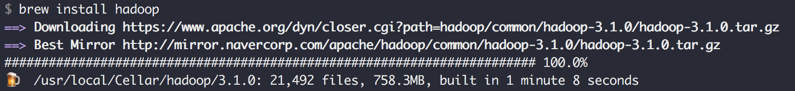

### Airpollution Analyzer
This is my first hadoop mapreduce program to analyze air pollution of Seoul, South Korea.  
There is two modules in this project. First, *airpollution-analyzer-mapreduce* is a module to run hadoop mapreduce. The other one is a *airpollution-analyzer-service* and it is a module to see mapreduce result using http.

### Getting started with airpollution-analyzer-mapreduce

#### general information. 

Step1) install hadoop.  

-  

