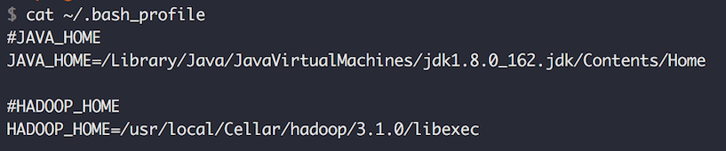
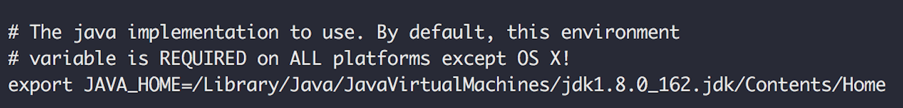
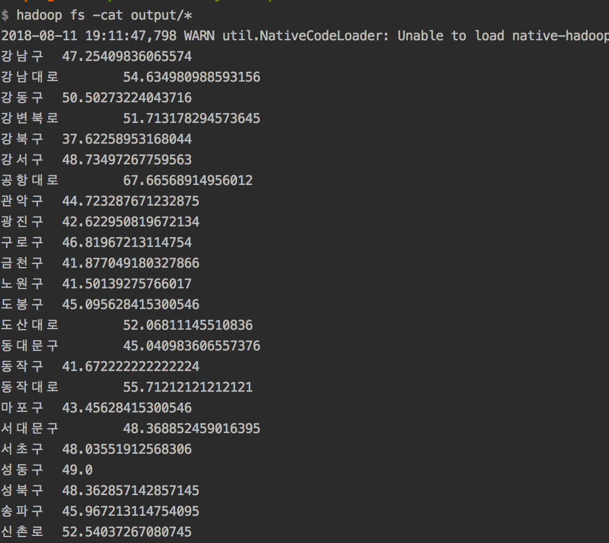

## Airpollution Analyzer
This is my first hadoop mapreduce program to analyze air pollution of Seoul, South Korea.  

### Getting started with airpollution-analyzer-mapreduce

**Step1) Install hadoop.**  
1. Install [brew](https://brew.sh).
2. Enter this command line 'brew install hadoop'. Then you can see it.  
3. After installation, you can see hadoop directory in /usr/local/Cellar/hadoop/3.1.0
4. To access hadoop bin in everywhere, setup HADOOP_HOME in ~/.bash_profile  
5. Go to $HADOOP_HOME/etc/hadoop/hadoop-env.sh and add only JAVA_HOME absolute path like this. 
6. Go to $HADOOP_HOME/etc/hadoop/core-site.xml and add below configurations.
   1. ```
      <configuration>
        <property>
          <name>fs.defaultFS</name>
          <value>hdfs://localhost:9000</value>
        </property>
        <property>
          <name>hadoop.tmp.dir</name>
          <value>/usr/local/Cellar/hadoop/data/</value>
        </property>
      </configuration>
      ```
7. Go to $HADOOP_HOME/etc/hadoop/hdfs-site.xml and add below configurations.
   1. ```
      <configuration>
        <property>
          <name>dfs.replication</name>
          <value>1</value>
        </property>
        <property>
          <name>dfs.http.address</name>
          <value>localhost:50070</value>
        </property>
        <property>
          <name>dfs.secondary.http.address</name>
          <value>localhost:50090</value>
        </property>
      </configuration>
      ```
8. Go to $HADOOP_HOME and run `./bin/hdfs namenode -format`
9. Go to $HADOOP_HOME and run `./sbin/start-dfs.sh` 
10. Then, you can browse the web interface for the NameNode http://localhost:50070/. 
11. Run cmd `hadoop fs -mkdir -p /user/user_name`  

If you want to know more detail, please take a look [official document](https://hadoop.apache.org/docs/stable/hadoop-project-dist/hadoop-common/SingleCluster.html). 

**Step2) Run Application**

1. Run cmd `cd airpollution-analyzer/airpollution-analyzer-mapreduce`
2. Run cmd `gradle clean build`
3. Run cmd `hadoop jar build/libs/airpollution-analyzer-mapreduce-1.0-SNAPSHOT.jar output`
   1. After run cmd, you can see below line.
   2. `INFO mapreduce.Job:  map 100% reduce 100%`
   3. `INFO mapreduce.Job: Job job_local1168524879_0001 completed successfully`
4. To see the mapreduce result, run cmd `hadoop fs -cat output/*`
   1. After run cmd, you can see this.
   2. 